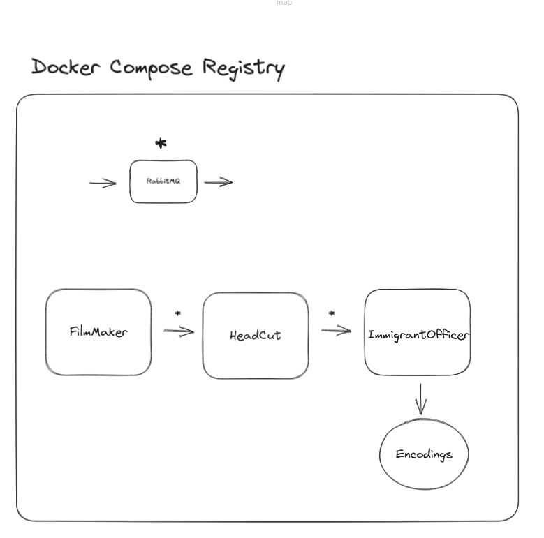
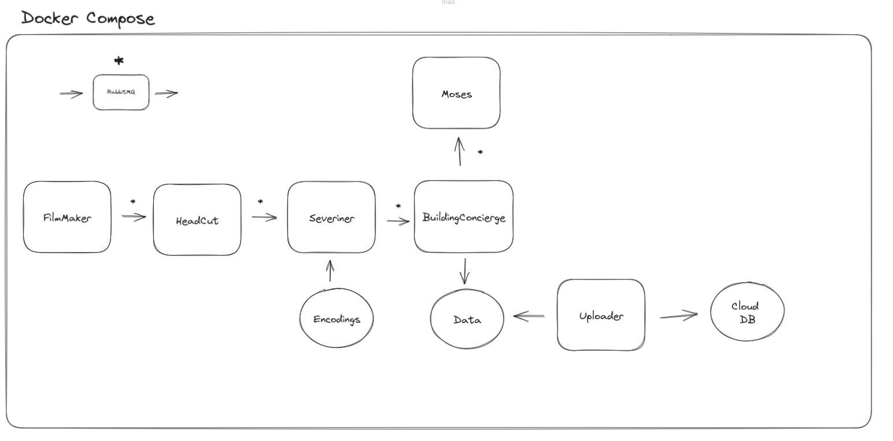

# Facial Recognition for Access Control Project

This is a facial recognition project developed for access control purposes, utilizing a series of interconnected modules. The system can capture camera images, identify faces, perform facial recognition, apply entry rules, record access events, and even control automatic door opening. Communication between modules is facilitated using RabbitMQ, and the entire project is implemented in Python.

## Architeture

### Register new encodings

### Prod System

## Architecture Components

The project consists of the following modules:

## Filmmaker 

This module is responsible for capturing camera feeds, obtaining frames for further processing.

## Headcut 

The module performs face detection on the frames captured by the camera, determining the presence of faces.

## Severiner 

Severiner is responsible for facial recognition. It uses the faces detected by the HeadCutter to compare against faces registered in the system and determine the individual's identity.

## Buildingconcierge 

This module applies access rules based on information obtained by Severiner. If the facial recognition is positive and meets predefined rules, BuildingConcierge controls door opening and records the access event.

## Moses 

The moses module is responsible for physical control, automatically opening the door according to instructions from BuildingConcierge.

## Imigrationofficer 

imigrationofficer handles the registration of new faces in the system. It receives captured images from the camera, performs face detection, and stores the faces in the database for later use in facial recognition.

## Roadmap Features
- Limit time to register new users
- Add Socket for messages
- Add Uploader to data register on cloud
